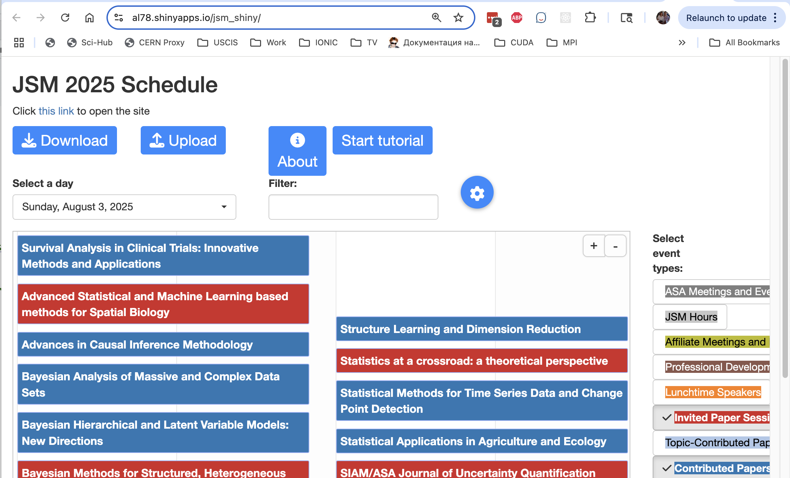

# Short Overview

This [web application](https://al78.shinyapps.io/jsm_shiny/) will help you navigate the upcoming [JSM 2025 meeting](https://ww2.amstat.org/meetings/jsm/2025/). All information, obtained by scraping the official program [website](https://ww3.aievolution.com/JSMAnnual2025/Events/pubSearchOptions?style=0), is presented in a neat graphical format. You can easily select and save events you're interested in attending, filter out other sessions, inspect the details of each session, and more.

This application was created using the R Shiny framework. All the code is available on the [GitHub page](https://github.com/ALuchinsky/jsm_schedule).

# Page Layout

The typical page layout is shown in the figure below. As you can see, it consists of several blocks:

- **Control buttons**, including:
  - **Download** – Allows you to download a text file containing selected events.
  - **Upload** – Allows you to upload a saved file to continue your scheduling later.
  - **About** - Display information about the application (almost this text).
  - **Start tutorial** - Shown a short interactive tutorial about the application

- **Option controls**, including:
  - **Active day selector** – Lets you choose which days to display. Note: it's possible to display several days (even all of them), but the timetable visualization may appear cluttered.
  - **Text filter input box** – Lets you filter events by title or session number.
  - **Options** – Helps you choose which types of events are visible.

- **Time Table pane** – The main part of the application. All filtered events are displayed here. More details are provided below.

- **Event type selector** – Allows you to choose which session types to show in the table pane.

# Functionality

Typically, you start by selecting a specific day and exploring the available events. Each event is displayed as a rectangular tile showing the title. The tile is color-coded according to event type. Hovering over a tile displays brief details, and right-clicking on it opens a dialog window with more information (e.g., a list of talks).

Given the density of the JSM schedule, it makes sense to narrow your view to specific event types. This is done using the event type selector — a set of colored checkboxes on the right. You can select multiple types simultaneously. Additionally, you can filter events using the text input box located above the timetable pane.

To get more information about a specific event, right-click its tile. A dialog will appear displaying details such as room, number of talks, titles, and presenters — all scraped from the website. This information is cached, so it won’t be downloaded again.

To mark an event as selected, double-click it with the left mouse button. The selected event’s title will be capitalized, and any other overlapping events will be grayed out and made inactive. Double-clicking it again will unselect it.

In the Options dialog box, you can choose whether to show inactive, selected, or active non-selected events. This helps reduce clutter, highlight your selections, and identify events that can be added without scheduling conflicts.

You can save your selected events to a local file using the **Download** button. This simple text file will list selected events for each date, including time, title, session number, room, and more. You can later upload this file to continue scheduling.

# Typical Work Process

A typical workflow for building your schedule might look like this:

- Select a specific conference date and the event types you're interested in.
- Optionally, use the text filter box to search for specific sessions.
- Inspect the events and double-click those you'd like to attend.
- In the Options dialog box, hide shadowed events to eliminate time conflicts.
- Continue selecting sessions as desired (explore other days or event types).
- Hide selected events to discover additional non-conflicting options.
- Show only selected events to review your personal schedule.
- Save your selected event list to a text file.

Later, you can reload this file into the application, revise your selections, and continue planning.
